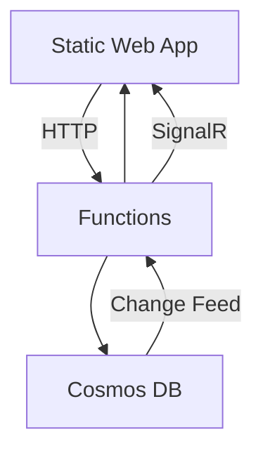
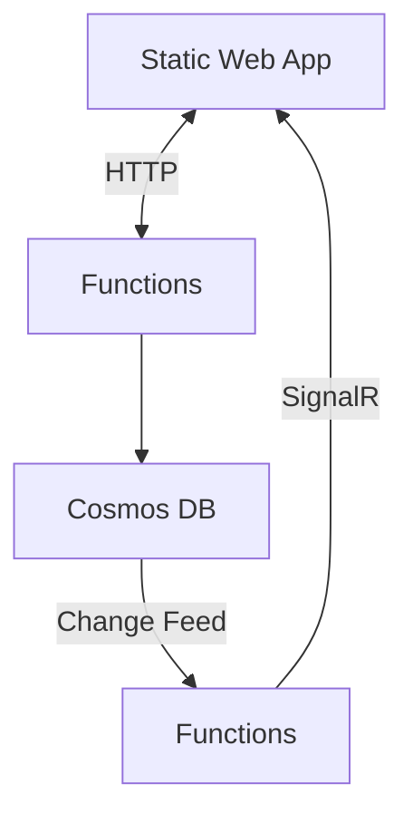

# nancop_anniversary

わーい
こんにちは
ごきげんよう
わいわい





- 接続時に過去に投稿されたメッセージがランダムにピックアップされて流れる。
- 新規投稿されたメッセージはリアルタイムで流れる。

## Cosmos DB のデータ構造

```json
{
    "id": "12345",
    "message": "こんにちは、みんな！ by 酒見",
    "timestamp": "2023-10-01T12:00:00Z",
    "year": 2026, // Parition Key
}
```

## 初期バージョンでは入れない機能

- 常連贔屓機能
- 新規贔屓機能
- 初コメに対して弾幕で歓迎する機能
- AOAI によるコメントのサジェストとか
