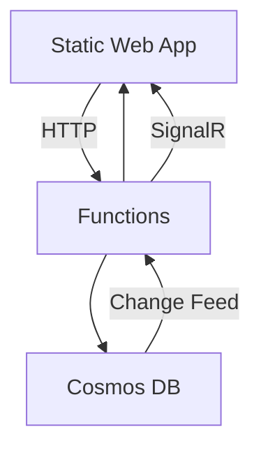
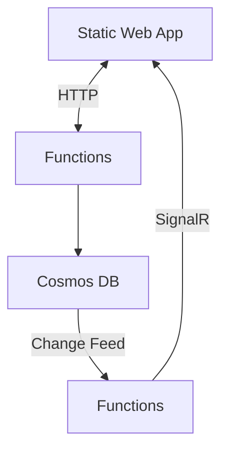

# Nancop Anniversary

🎉 Nancop Anniversaryのお祝いイベント用Webアプリケーション

## 概要

このプロジェクトは、インタラクティブなお祝いメッセージ機能を持つWebアプリケーションです。ユーザーはお祝いメッセージを送信でき、美しいアニメーションエフェクトが表示されます。

## 技術スタック

### フロントエンド
- **HTML5/CSS3/JavaScript** - バニラJSで実装（npmなし）
- **GSAP** - 高品質なアニメーション
- **Azure Static Web Apps** - ホスティング

### バックエンド
- **Azure Functions** - C# .NET 9.0
- **Azure Cosmos DB** - データストレージ

## 機能

### 🎊 お祝い機能
- **おめでとー** - オレンジグラデーションボタン
- **おめえと** - イエローグラデーションボタン  
- **おめでとう！** - レッドオレンジグラデーションボタン

### ✨ エフェクト
- **紙吹雪エフェクト** - お祝いメッセージ送信時
- **フローティングハート** - 通常メッセージ送信時
- **ギフト爆弾** - ギフトボタン押下時

### 📱 レスポンシブデザイン
- モバイルファーストデザイン
- 最大幅480pxのチャットアプリUI

## プロジェクト構造

```
nancop_anniversary/
├── FrontEnd/                    # Static Web App
│   ├── index.html              # メインページ
│   ├── styles.css              # スタイルシート
│   ├── script.js               # JavaScript機能
│   ├── config.js               # 環境設定
│   └── staticwebapp.config.json # Azure Static Web Apps設定
├── Functions/                   # Azure Functions
│   └── nancopa_anniversary/
│       ├── PostComment.cs      # コメント投稿API
│       ├── Comment.cs          # データモデル
│       └── host.json           # Functions設定
└── .github/workflows/          # CI/CD
    └── azure-static-web-apps.yml
```

## ローカル開発

### 前提条件
- .NET 9.0 SDK
- Azure Functions Core Tools
- Visual Studio Code（推奨）

### セットアップ

1. **リポジトリをクローン**
   ```powershell
   git clone <repository-url>
   cd nancop_anniversary
   ```

2. **Azure Functions の起動**
   ```powershell
   cd Functions
   func start
   ```

3. **フロントエンドの起動**
   ```powershell
   cd FrontEnd
   # Live Server拡張機能を使用してindex.htmlを開く
   ```

### 環境変数設定

`Functions/nancopa_anniversary/local.settings.json`:
```json
{
  "IsEncrypted": false,
  "Values": {
    "AzureWebJobsStorage": "",
    "FUNCTIONS_WORKER_RUNTIME": "dotnet-isolated",
    "CosmosDBConnection": "AccountEndpoint=https://your-cosmos-account.documents.azure.com:443/;AccountKey=your-key;"
  }
}
```

## デプロイ

### Azure Static Web Apps

1. **リソースの作成**
   - Azure PortalでStatic Web Appを作成
   - GitHubリポジトリと連携

2. **設定値**
   - App location: `/FrontEnd`
   - Api location: `/Functions`
   - Output location: `` (空)

3. **環境変数**
   Azure Portalで以下を設定:
   - `CosmosDBConnection`: Cosmos DBの接続文字列

### 自動デプロイ

GitHub Actionsによる自動デプロイが設定済み:
- `main`ブランチへのプッシュで自動デプロイ
- プルリクエストでプレビュー環境作成

## API仕様

### POST /api/PostComment

**リクエスト:**
```json
{
  "message": "お祝いメッセージ"
}
```

**レスポンス:**
```json
{
  "id": "uuid",
  "message": "投稿ありがとう！"
}
```

## ブラウザサポート

- Chrome 90+
- Firefox 88+
- Safari 14+
- Edge 90+

## ライセンス

このプロジェクトはMITライセンスの下で公開されています。

わーい
こんにちは
ごきげんよう
わいわい





- 接続時に過去に投稿されたメッセージがランダムにピックアップされて流れる。
- 新規投稿されたメッセージはリアルタイムで流れる。

## Cosmos DB のデータ構造

```json
{
    "id": "12345",
    "message": "こんにちは、みんな！ by 酒見",
    "timestamp": "2023-10-01T12:00:00Z",
    "year": 2026, // Parition Key
}
```

## 初期バージョンでは入れない機能

- 常連贔屓機能
- 新規贔屓機能
- 初コメに対して弾幕で歓迎する機能
- AOAI によるコメントのサジェストとか
